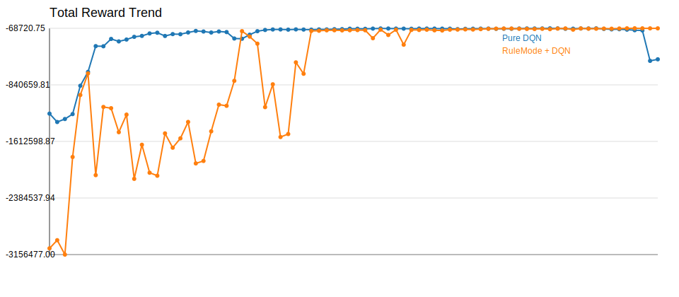
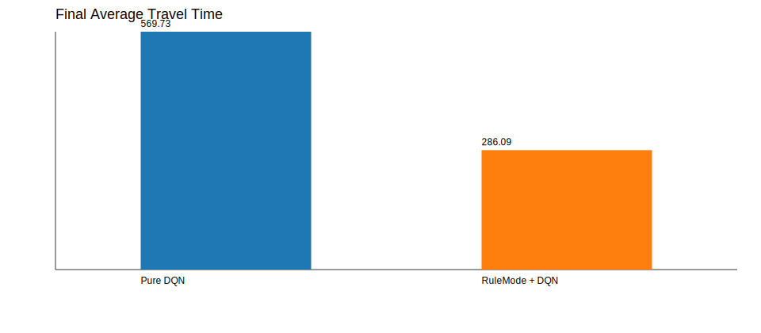

# Experiment Comparison

| Experiment | Model | Selector | Episodes | Total Reward | Avg Wait | Avg Queue | Throughput | Avg Travel | Current Mode |
| --- | --- | --- | --- | --- | --- | --- | --- | --- | --- |
| Pure DQN | AdvancedDQN | off | 160 | -492045.75 | 373.10 | 45.56 | 3721.00 | 569.73 | balanced |
| RuleMode + DQN | AdvancedDQN | on | 160 | -69545.75 | 50.73 | 6.44 | 5010.00 | 286.09 | balanced |

