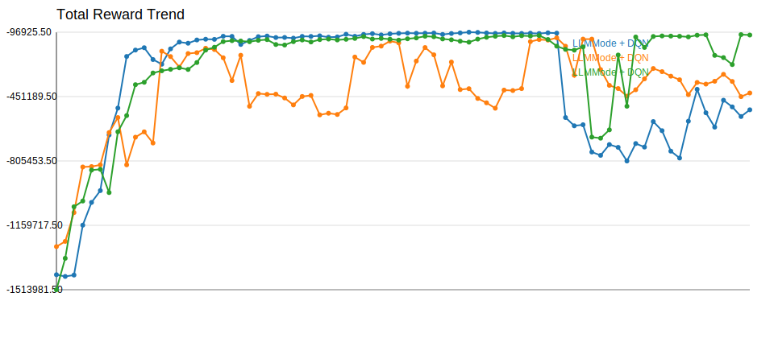
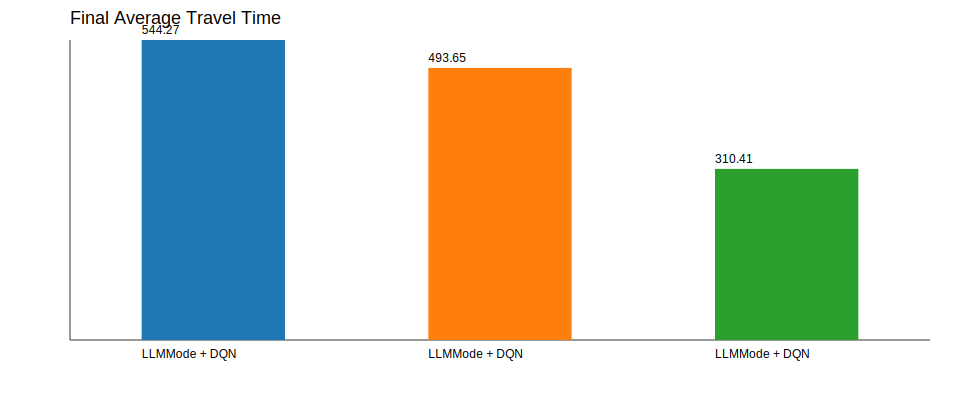

# Experiment Comparison

| Experiment | Model | Selector | Episodes | Total Reward | Avg Wait | Avg Queue | Throughput | Avg Travel | Current Mode |
| --- | --- | --- | --- | --- | --- | --- | --- | --- | --- |
| LLMMode + DQN | AdvancedDQN | llm:api | 160 | -523843.75 | 347.20 | 48.50 | 4324.00 | 544.27 | balanced |
| LLMMode + DQN | AdvancedDQN | llm:api | 160 | -431474.50 | 281.91 | 39.95 | 4669.00 | 493.65 | balanced |
| LLMMode + DQN | AdvancedDQN | llm:api | 160 | -112489.50 | 71.61 | 10.42 | 5716.00 | 310.41 | balanced |

