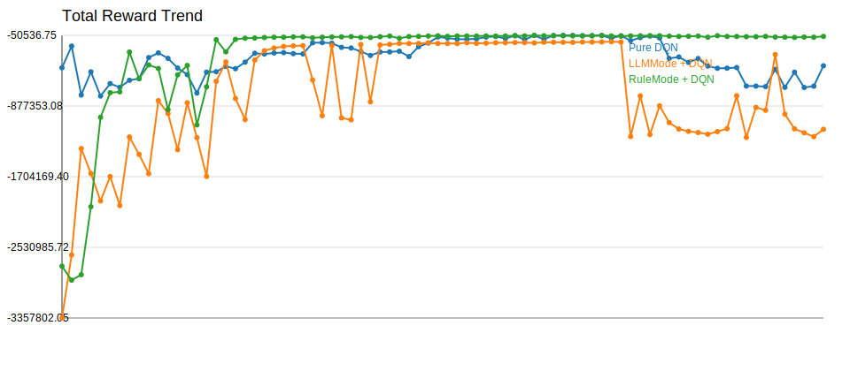
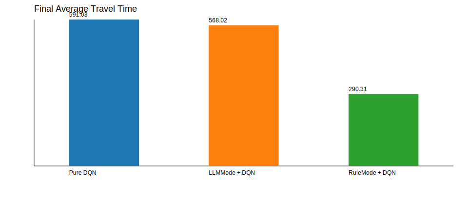

# Experiment Comparison

| Experiment | Model | Selector | Episodes | Total Reward | Avg Wait | Avg Queue | Throughput | Avg Travel | Current Mode |
| --- | --- | --- | --- | --- | --- | --- | --- | --- | --- |
| Pure DQN | AdvancedDQN | off | 160 | -406956.00 | 381.72 | 37.68 | 3304.00 | 591.03 | balanced |
| LLMMode + DQN | AdvancedDQN | llm:api | 160 | -1149819.15 | 363.37 | 36.02 | 3273.00 | 568.02 | queue_clearance |
| RuleMode + DQN | AdvancedDQN | rule | 160 | -63191.85 | 46.26 | 4.67 | 4140.00 | 290.31 | balanced |

