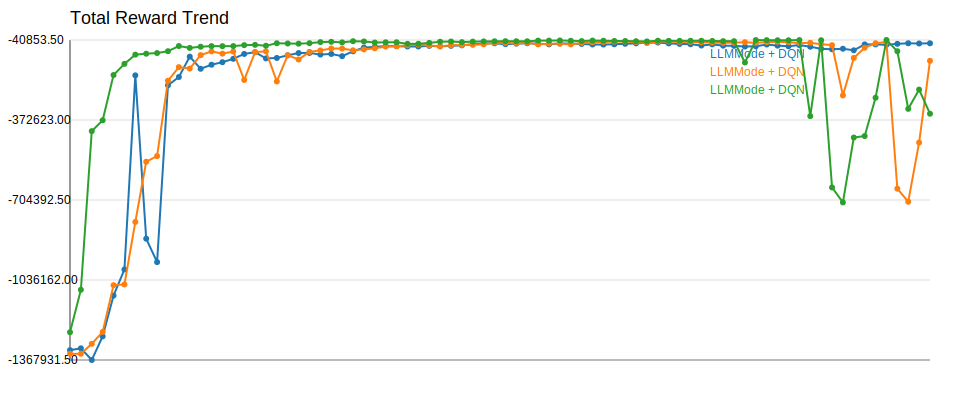
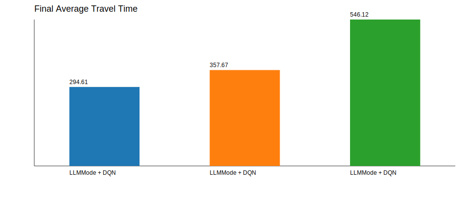

# Experiment Comparison

| Experiment | Model | Selector | Episodes | Total Reward | Avg Wait | Avg Queue | Throughput | Avg Travel | Current Mode |
| --- | --- | --- | --- | --- | --- | --- | --- | --- | --- |
| LLMMode + DQN | AdvancedDQN | llm:api | 160 | -54399.25 | 49.92 | 5.04 | 4141.00 | 294.61 | balanced |
| LLMMode + DQN | AdvancedDQN | llm:api | 160 | -127243.00 | 116.68 | 11.78 | 3941.00 | 357.67 | balanced |
| LLMMode + DQN | AdvancedDQN | llm:api | 160 | -346622.25 | 329.95 | 32.09 | 3350.00 | 546.12 | balanced |

