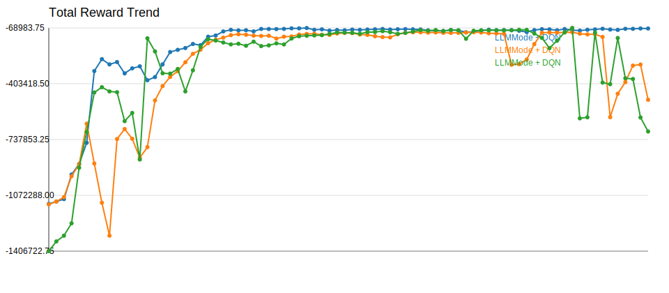
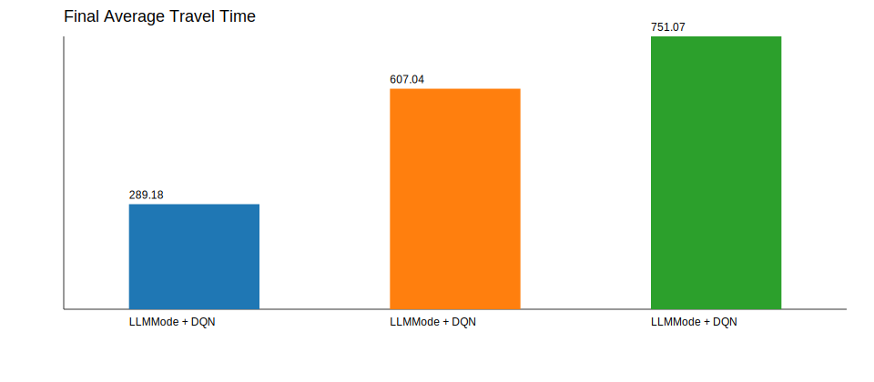

# Experiment Comparison

| Experiment | Model | Selector | Episodes | Total Reward | Avg Wait | Avg Queue | Throughput | Avg Travel | Current Mode |
| --- | --- | --- | --- | --- | --- | --- | --- | --- | --- |
| LLMMode + DQN | AdvancedDQN | llm:api | 160 | -72526.75 | 52.89 | 6.72 | 5004.00 | 289.18 | balanced |
| LLMMode + DQN | AdvancedDQN | llm:api | 160 | -499678.25 | 405.31 | 46.27 | 3519.00 | 607.04 | balanced |
| LLMMode + DQN | AdvancedDQN | llm:api | 160 | -689475.50 | 571.73 | 63.84 | 3004.00 | 751.07 | balanced |

