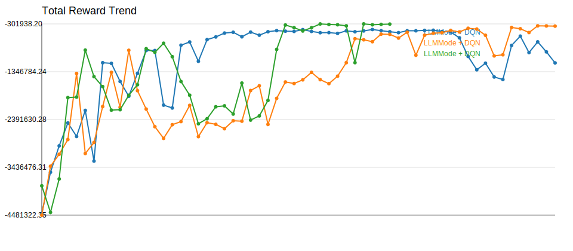
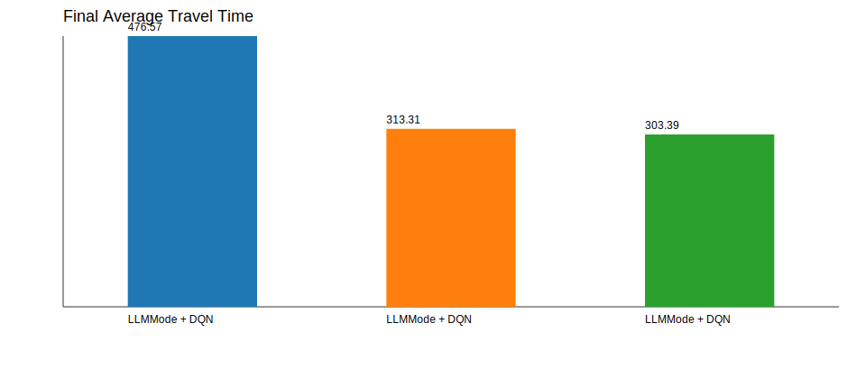

# Experiment Comparison

| Experiment | Model | Selector | Episodes | Total Reward | Avg Wait | Avg Queue | Throughput | Avg Travel | Current Mode |
| --- | --- | --- | --- | --- | --- | --- | --- | --- | --- |
| LLMMode + DQN | AdvancedDQN | llm:api | 120 | -1154730.10 | 262.47 | 35.55 | 4526.00 | 476.57 | queue_clearance |
| LLMMode + DQN | AdvancedDQN | llm:api | 120 | -350658.05 | 74.15 | 10.79 | 5659.00 | 313.31 | queue_clearance |
| LLMMode + DQN | AdvancedDQN | llm:api | 82 | -306209.85 | 64.56 | 9.39 | 5745.00 | 303.39 | queue_clearance |

