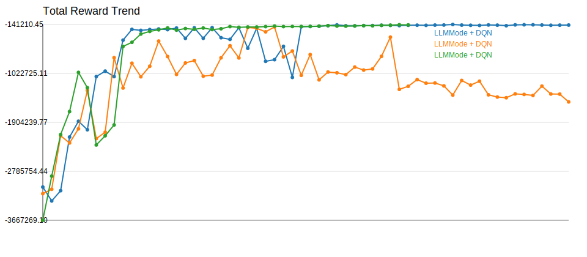
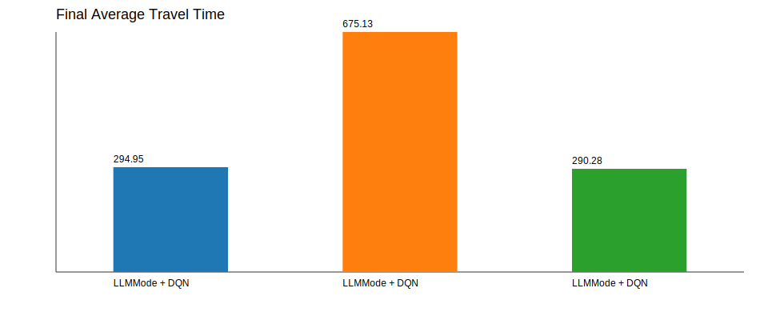

# Experiment Comparison

| Experiment | Model | Selector | Episodes | Total Reward | Avg Wait | Avg Queue | Throughput | Avg Travel | Current Mode |
| --- | --- | --- | --- | --- | --- | --- | --- | --- | --- |
| LLMMode + DQN | AdvancedDQN | llm:api | 120 | -151782.90 | 50.66 | 5.11 | 4127.00 | 294.95 | queue_clearance |
| LLMMode + DQN | AdvancedDQN | llm:api | 120 | -1535463.30 | 483.90 | 47.52 | 2982.00 | 675.13 | queue_clearance |
| LLMMode + DQN | AdvancedDQN | llm:api | 85 | -149712.80 | 45.21 | 4.56 | 4142.00 | 290.28 | queue_clearance |

