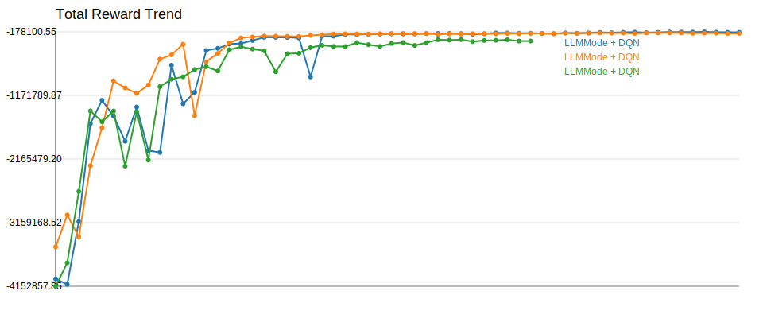
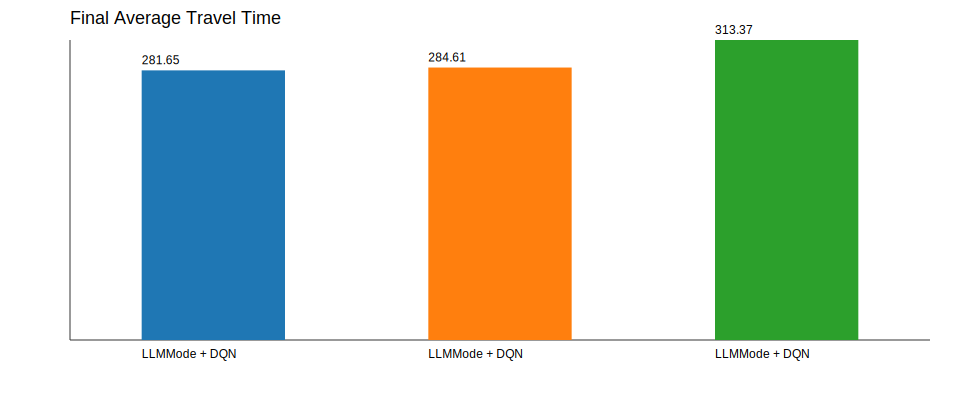

# Experiment Comparison

| Experiment | Model | Selector | Episodes | Total Reward | Avg Wait | Avg Queue | Throughput | Avg Travel | Current Mode |
| --- | --- | --- | --- | --- | --- | --- | --- | --- | --- |
| LLMMode + DQN | AdvancedDQN | llm:api | 120 | -185542.45 | 45.80 | 5.81 | 5028.00 | 281.65 | queue_clearance |
| LLMMode + DQN | AdvancedDQN | llm:api | 120 | -202680.10 | 48.68 | 6.18 | 5014.00 | 284.61 | queue_clearance |
| LLMMode + DQN | AdvancedDQN | llm:api | 84 | -321983.80 | 77.04 | 9.79 | 4993.00 | 313.37 | queue_clearance |

